# Hi, I’m Wahid 👋

✨ I build **full-stack web apps** and enjoy shipping clean, user-focused features — from UI polish to backend APIs.

  
  
  

---

## 🚀 What I’m focused on right now
- 🧱 Building production-style projects (**React/Next.js + FastAPI**)
- 🧼 Improving code quality (architecture, testing habits, documentation)
- 🤖 Exploring AI features that fit real products (**RAG, agents, evaluation**)

---

## 🧰 Tech stack

### 🗣️ Languages

### 🎨 Frontend

### 🧠 Backend

### 🛠️ Tools

---

## 📌 Featured work
If you want the best overview, check my **pinned repos** — I keep them updated with live demos + README docs. ✅

---

## 🌿 My passions
- 🥋 Martial arts
- 🎬 Film making
- 🌲 Nature

---

## 🤝 Let’s connect
- 🔗 GitHub: https://github.com/Wahid-Haidari  
- 💼 LinkedIn: https://www.linkedin.com/in/w-haidari/  
- 🌐 Portfolio: https://wahid-haidari.github.io/portfolio/  

---

## 📊 GitHub stats

